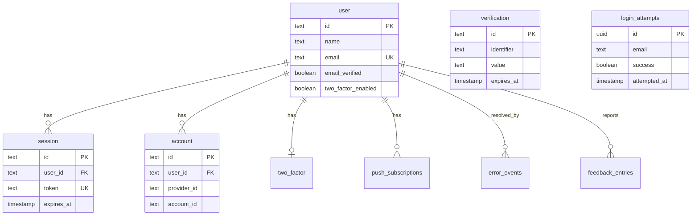
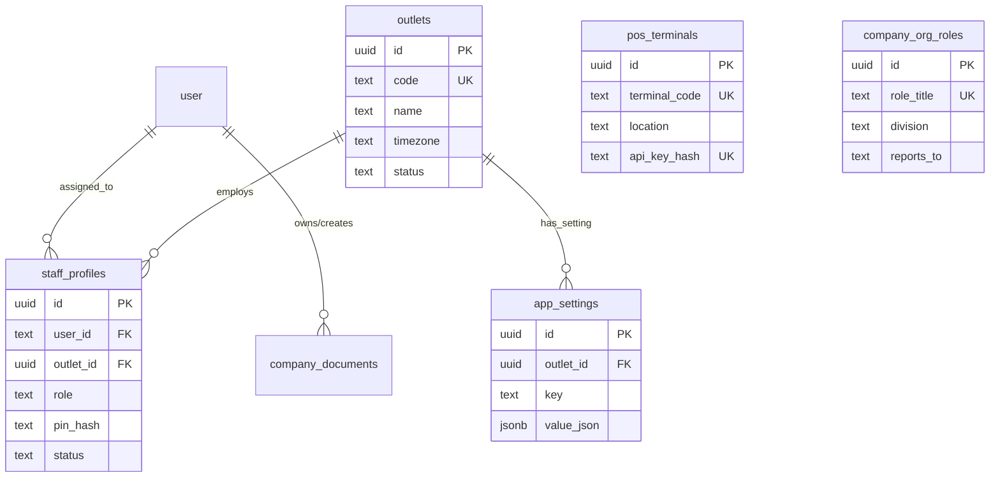
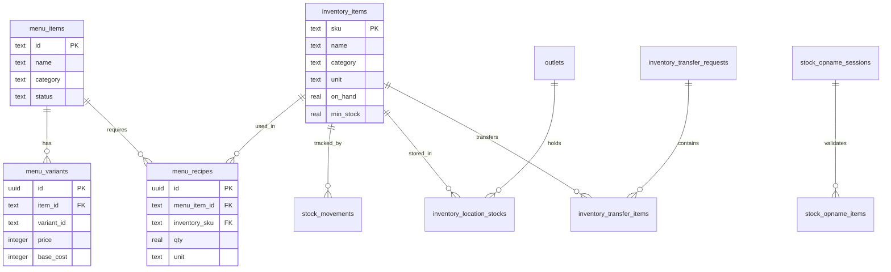
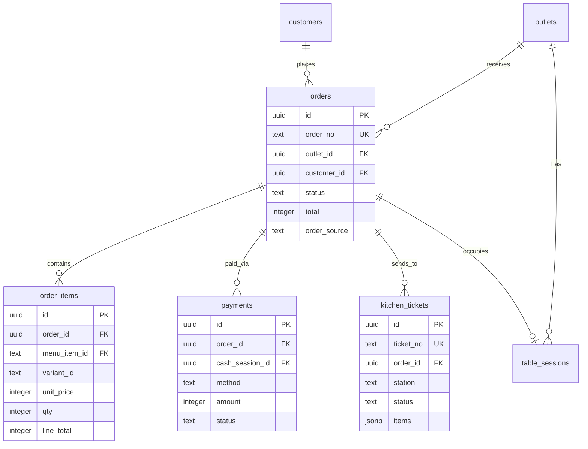
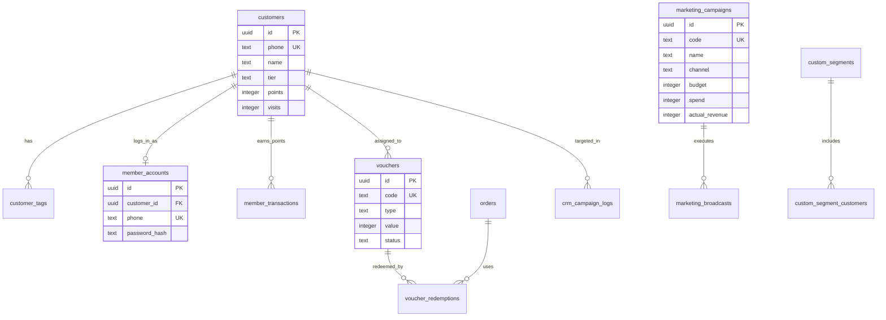
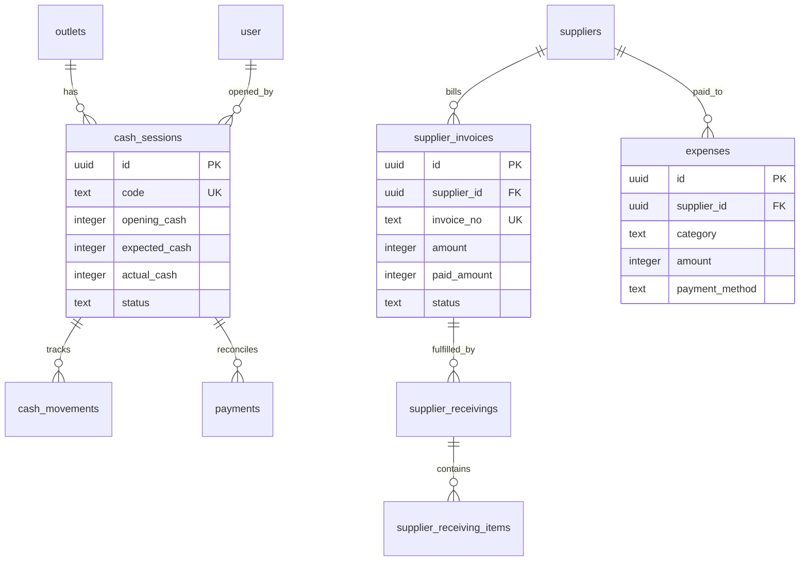
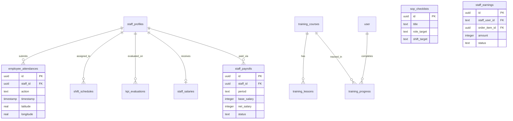
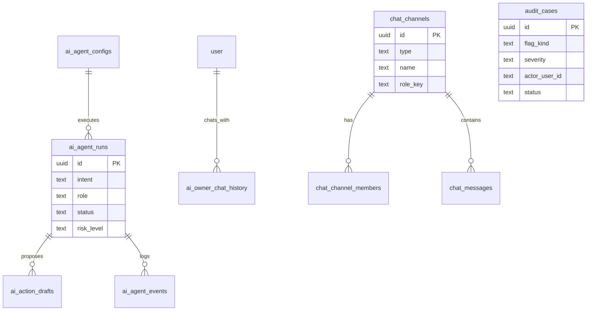

# ERD & Skema Database (Garage App)

Dokumen ini berisi representasi diagram Entity-Relationship (ERD) dan penjelasan rinci skema database untuk aplikasi **Garage**. Database ini dibangun menggunakan Drizzle ORM dengan PostgreSQL.
Mengingat aplikasi memiliki sekitar 91 tabel, skema telah dikelompokkan menjadi beberapa modul bisnis utama agar lebih mudah dipahami.

---

## 1. Modul Autentikasi & Pengguna (Auth & Users)

Modul ini menangani manajemen pengguna utama (user), autentikasi, sesi, keamanan, dan interaksi umum sistem.

**Penjelasan Kolom Penting:**
- `user`: Merupakan entitas induk untuk seluruh akun login (termasuk staf, admin, owner). `email` harus unik.
- `login_attempts`: Digunakan sebagai audit keamanan untuk mencegah serangan brute force.

---

## 2. Modul Master Data & Organisasi (Master & Org)

Menangani cabang (outlet), profil karyawan, konfigurasi sistem per-outlet, terminal kasir, dan hierarki organisasi.

**Penjelasan Kolom Penting:**
- `staff_profiles`: Menyimpan data kepegawaian yang melengkapi tabel `user`. Terdapat PIN untuk login POS cepat (`pin_hash`).
- `app_settings`: Disimpan dalam bentuk Key-Value dengan nilai berformat JSON. Mendukung pengaturan global (jika `outlet_id` null).

---

## 3. Modul Produk & Inventaris (Product & Inventory)

Menangani item menu yang dijual, bahan baku (inventory), mutasi stok, hingga pembuatan resep (BOM/COGS).

**Penjelasan Relasi:**
- `menu_recipes` berfungsi sebagai tabel relasi *Many-to-Many* antara `menu_items`/`menu_variants` dengan `inventory_items` untuk kalkulasi Harga Pokok Penjualan (HPP / Base Cost) dan deduksi stok otomatis.

---

## 4. Modul Pemesanan & Dapur (Orders & Kitchen)

Modul inti sistem Kasir/POS. Menangani pemesanan, tiket dapur, dan status meja.

**Alur Kerja:**
- Sebuah `order` dapat memiliki banyak `order_items` dan `payments` (split bill).
- `kitchen_tickets` dibuat berdasarkan stasiun (misal: "Bar", "Kitchen") dengan menampung array `items` berformat JSON.

---

## 5. Modul Pelanggan, CRM & Marketing

Menangani data loyalitas pelanggan, voucher, riwayat poin, segmentasi pelanggan dinamis, hingga log kampanye broadcast.

**Penjelasan CRM:**
- `custom_segments`: Mendefinisikan kriteria aturan pengguna berbasis JSON.
- `marketing_campaigns`: Digunakan untuk promosi spesifik yang dapat terhubung dengan `vouchers`.

---

## 6. Modul Keuangan, Kas & Pemasok (Finance & Cash)

Mengelola manajemen kasir (buka-tutup kas), pengeluaran operasional (expenses), pembelian barang (receivings) dan utang dagang (supplier invoices).

---

## 7. Modul SDM, Operasional & Pelatihan (HR, Ops & Training)

Modul besar yang mengurus presensi geolokasi, KPI, penggajian (payroll), ceklist SOP, dan e-learning/pelatihan karyawan.

**Fitur Tambahan SDM:**
- `staff_earnings`: Komisi/insentif yang dihitung per penjualan item untuk staf bersangkutan.
- `employee_attendances`: Mendukung data latitude & longitude untuk validasi presensi di lokasi (Outlet).

---

## 8. Modul AI, Komunikasi Internal & Audit

Modul ini bertanggung jawab untuk log tindakan AI, chat internal antar staf/sistem, dan penanganan kasus audit (Audit Cases).

**Fungsi AI & Audit:**
- `ai_agent_runs`: Mencatat eksekusi perintah AI, konsumsi token, dan fallback mechanism.
- `ai_action_drafts`: Sistem menyetujui (approval) aksi berisiko tinggi yang diusulkan oleh agen AI sebelum dieksekusi.
- `audit_cases`: Sistem deteksi anomali internal perusahaan (misal: void transaksi terus menerus) yang menjadi tiket investigasi.

---
*Dokumen ini di-generate secara otomatis berdasarkan file `schema.ts` terbaru. Jika ada perubahan kolom/tabel di kode sumber, maka dokumen ERD ini harus di-update sesuai perubahan tersebut.*
