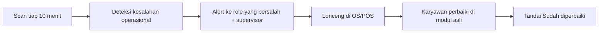

# GARAGE AI — Flow Pengawasan Karyawan

Panduan operasional untuk pola kerja **pengawasan karyawan**: mendeteksi kesalahan, mengingatkan perbaikan, dan memberi tahu supervisor.

Konsep teknis: [GARAGE-AI-FINAL-CONCEPT.md](./GARAGE-AI-FINAL-CONCEPT.md)

---

## 1. Pola kerja baru (inti)



| Jenis alert | Arti | Contoh |
| --- | --- | --- |
| **Kesalahan** | Sudah melanggar SLA/SOP | QR pending >5 menit, kitchen delay parah |
| **Perlu dibenahi** | Harus segera dikoreksi | Stok kritis, pembayaran tertunda, approval menumpuk |
| **Pengingat SOP** | Coaching preventif | Banyak QR ditolak, stok mendekati minimum |

**Chat CEO Brain** tetap ada untuk owner/manager (analisis), tetapi **pengawasan harian = lonceng**, bukan chat.

### Suara CEO, naskah, dan MP3

Panduan lengkap (18 naskah, export MP3, prompt Claude, pengaturan Edge/ElevenLabs): **[GARAGE-VOICE-LENGKAP.md](./GARAGE-VOICE-LENGKAP.md)**

Ringkas: pilih **Edge neural** di Smart Notification Center; hindari **Browser TTS** jika suara Windows masih Inggris.

---

## 2. Apa yang diawasi otomatis

| Area | Kesalahan yang dideteksi | Role yang diingatkan |
| --- | --- | --- |
| **Floor (kasir/waiter)** | QR tidak di-Accept/Reject tepat waktu | Kasir, Waiter, Supervisor |
| **Floor** | Pembayaran tertunda setelah order diterima | Kasir, Supervisor |
| **Floor** | Terlalu banyak order QR ditolak | Kasir, Supervisor |
| **Kitchen** | Ticket melewati target menit | Barista, Koki, Supervisor |
| **Gudang** | Stok kritis / mendekati minimum | Gudang, Manager |
| **Control** | Approval pending terlalu lama | Manager, Owner, Finance |
| **Control** | Audit log warning/critical per aktor | Supervisor |
| **Finance** | Selisih kas, settlement, cash session | Kasir, Finance, Manager |

Supervisor **selalu** mendapat salinan alert **high** dari floor & kitchen.

---

## 3. Flow harian per role

### Kasir / Waiter / Kitchen / Gudang (tampilan sederhana)

1. Klik **lonceng** di header ATAU buka modul **GARAGE AI** → halaman **Pengingat Kerja**.
2. Baca kartu: jenis (Kesalahan / Perlu dibenahi / Pengingat) + **Yang harus dilakukan**.
3. Kerjakan di modul asli (POS, Kitchen, Inventory).
4. Tombol **Sudah diperbaiki**.

Tidak perlu membuka chat, autopilot, atau tab teknis.

### Kasir / Waiter (lonceng saja)

1. Lihat **lonceng** → baca jenis: Kesalahan / Perlu dibenahi / Pengingat SOP.
2. Baca langkah perbaikan di kartu.
3. Kerjakan di **POS** (Accept QR, proses bayar, dll.).
4. Klik **Sudah diperbaiki**.

### Kitchen / Bar

1. Lonceng → ticket delay.
2. Prioritaskan di **Kitchen (KDS)**.
3. **Sudah diperbaiki** setelah station clear.

### Gudang

1. Lonceng → stok kritis/watch.
2. **Inventory** → movement / receiving.
3. **Sudah diperbaiki**.

### Supervisor / Manager

1. Lonceng → semua eskalasi + ringkasan tim.
2. Koordinasi karyawan yang bersalah (langsung di floor).
3. Bisa **Scan pengawasan karyawan sekarang** di menu lonceng.
4. Approval & void tetap di modul **Approvals** (AI tidak eksekusi).

### Owner

1. Pagi/sore: lonceng + optional **Tanya AI** untuk brief.
2. Fokus alert **control** & finance.
3. Putuskan approval kritis.

---

## 4. Setup sekali

```env
DATABASE_URL=...
GARAGE_JOB_SECRET=...     # cron / CLI
OPENAI_API_KEY=...        # hanya untuk chat (opsional pengawasan)
AI_CONFIG_ENCRYPTION_KEY=...
```

| Langkah | Lokasi |
| --- | --- |
| Autopilot ON, jam operasional | Pengaturan → GARAGE AI |
| Nomor WA per grup (opsional) | Pengaturan → GARAGE AI |
| Cron 10 menit | `vercel.json` atau Task Scheduler LAN |
| Tes scan | Lonceng → **Scan pengawasan karyawan sekarang** |

```powershell
npm run ai:shift-copilot
```

---

## 5. SLA disarankan (SOP manusia)

| Sinyal | SLA perbaikan |
| --- | --- |
| QR pending high | ≤ 2 menit |
| QR pending medium | ≤ 5 menit |
| Kitchen delay high | ≤ 10 menit |
| Stok kritis | same shift |
| Approval stale | hari yang sama |

---

## 6. Yang AI tidak lakukan

- Tidak menghukum / tidak memotong gaji otomatis
- Tidak void/refund/closing otomatis
- Tidak menggantikan keputusan supervisor di Approvals
- WhatsApp: link terisi, **kirim manual** oleh staf

---

## 7. Ringkasan

> **GARAGE AI = pengawas shift:** scan data → klasifikasi kesalahan → ingatkan karyawan + supervisor → manusia perbaiki → ack.

Chat LLM = lapisan analisis owner, bukan fondasi pengawasan harian.
