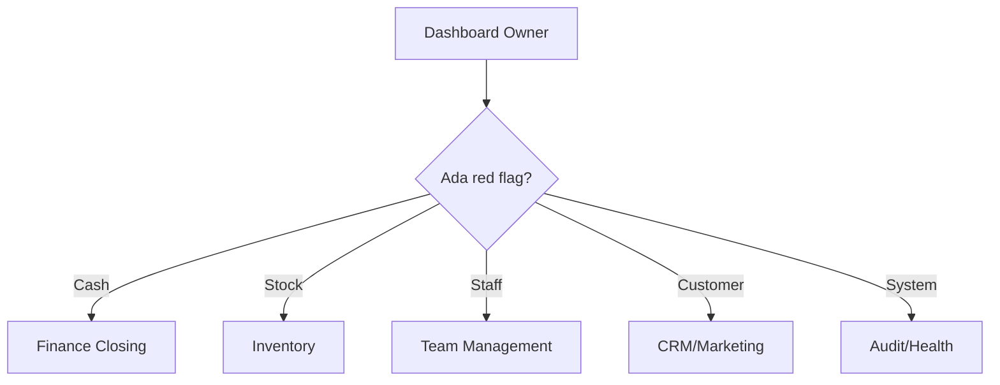

# OWNER PLAYBOOK GarageOS

## Morning Review

- Buka Dashboard.
- Cek revenue kemarin/hari ini.
- Cek low stock.
- Cek pending approval.
- Cek issue audit atau complaint.

## Daily KPI

- Omzet harian.
- Net profit/AOV.
- Order count.
- Kitchen SLA.
- Cash discrepancy.
- Low stock critical.
- Pending approval.

## Weekly KPI

- Top product.
- Margin menu.
- Staff attendance.
- Campaign performance.
- Repeat customer/member activity.

## Monthly KPI

- Profit/loss.
- Supplier cost.
- Payroll/earnings.
- Inventory shrinkage.
- Customer growth.

## Decision Dashboard

## Profit Monitoring

- Bandingkan revenue, COGS, expense, dan cash settlement.
- Review margin menu melalui Finance/Menu Engineering.

## Inventory Monitoring

- Cek low stock dan smart reorder.
- Review opname dan movement yang butuh approval.

## People Monitoring

- Cek attendance, shift, KPI, payroll, advances.
- Review SOP completion dan handover.

## Financial Health

- Tidak ada cash session terbuka lama.
- Selisih kas dijelaskan.
- Expense besar punya approval.
- Supplier invoice punya status bayar jelas.

## Red Flag System

- Selisih kas besar.
- Void/refund berulang.
- Stok minus/low tanpa receiving.
- Complaint customer berulang.
- Login gagal berulang.

## CEO Shortcut

Dashboard -> Approvals -> Finance -> Inventory -> Audit -> Team -> Daily Brief Export.
