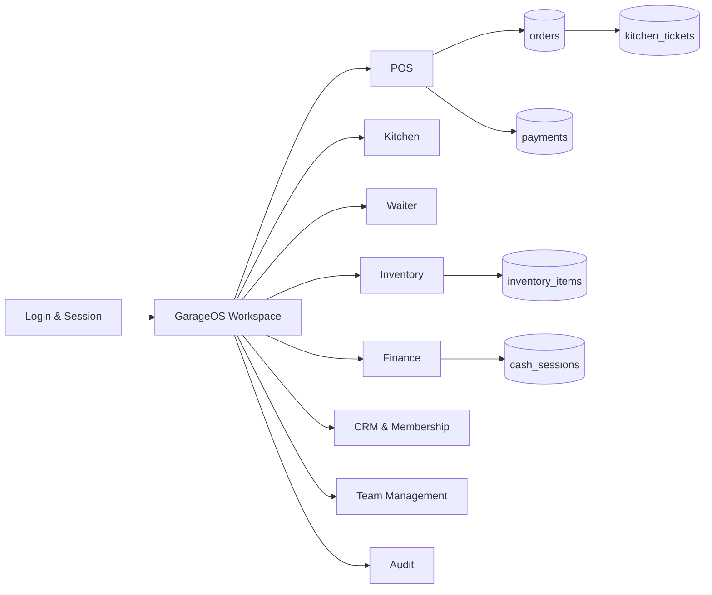

# SYSTEM OVERVIEW GarageOS

GarageOS adalah operating system internal untuk cafe/coffee & motor dengan POS, kitchen, waiter, inventory, finance, CRM, membership, marketing, HR, recruitment, audit, dan owner dashboard.

## Source Evidence

- Pages: 64
- API routes: 328
- Database entities: 102
- Role source: `src/lib/role-access.ts`
- Main shell: `src/components/garage/garage-app.tsx`

## Core Architecture

## Role Principle

Sidebar dan API dibatasi oleh role. Staff hanya boleh melihat modul yang muncul pada akun mereka. Jika tombol tidak muncul, jangan mencari jalan pintas.

## Operational Definition of Done

Satu order dinyatakan selesai operasional bila: customer/kasir membuat order -> kitchen menerima ticket -> item ready -> waiter deliver -> bill/payment selesai -> receipt tersedia -> meja dibersihkan -> laporan harian berubah -> backup aman. Checklist repo menunjukkan golden path ini masih perlu UAT manual sebelum klaim go-live penuh.
