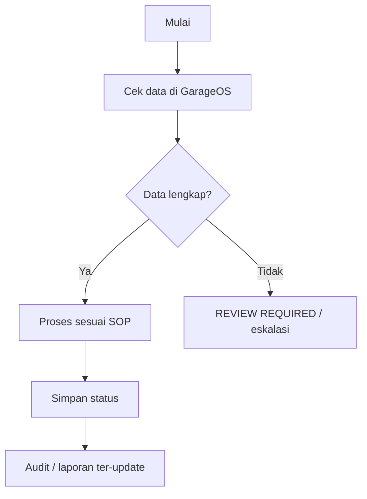

# INVENTORY FLOW

Produk dan bahan dikelola lewat inventory: SKU, stok minimum, movement, receiving, transfer, opname, smart reorder, dan audit daily.

## Diagram

## PASS / FAIL Testing

| Check | Status | Problem | Impact | Suggested Fix | Priority |
| --- | --- | --- | --- | --- | --- |
| Flow tersedia di route/API | PASS | Route dan entity ditemukan di source | Flow dapat didokumentasikan | Tetap verifikasi manual di device | Medium |
| Bukti end-to-end runtime | NEED REVIEW | Generator tidak menjalankan transaksi nyata | Belum bisa klaim siap operasional penuh | Jalankan UAT satu order sampai report dan backup | High |
