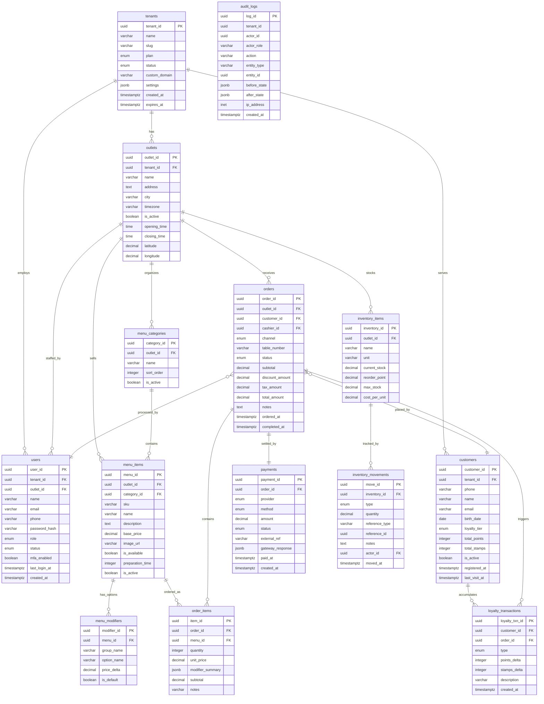
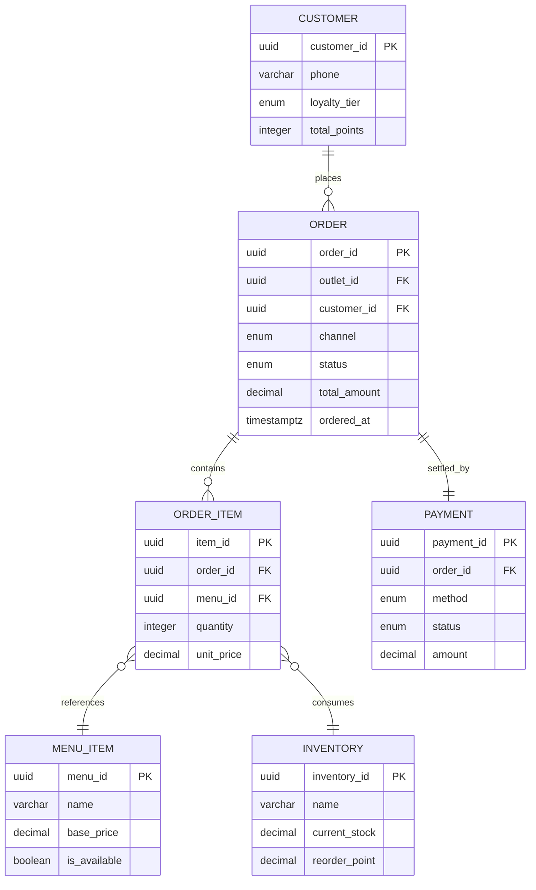

# DOKUMEN 2: ENTITY RELATIONSHIP DIAGRAM (ERD) & STRUKTUR DATA
## GARAGE — Coffee-Tech Operating Ecosystem
**Versi:** 2.0 | **Status:** Final Draft | **Tahun:** 2026  
**Pemilik Dokumen:** CTO / Technical Architect  
**Klasifikasi:** CONFIDENTIAL — Internal Use Only

---

## DAFTAR ISI
1. Ringkasan Arsitektur Data
2. Identifikasi Entitas Utama dan Atributnya
3. Relasi Antar Entitas
4. Entity Relationship Diagram (Mermaid.js)
5. Penjelasan Alur Data Kritis
6. Konvensi dan Standar Database

---

## 1. RINGKASAN ARSITEKTUR DATA

### 1.1 Prinsip Desain Database

Database GARAGE OS didesain berdasarkan tiga prinsip utama:

1. **Auditability First** — Setiap perubahan data penting harus dapat ditelusuri siapa yang melakukan, kapan, dan apa yang diubah. Tabel `audit_logs` mencatat seluruh aksi kritikal.

2. **Multi-Tenant Ready** — Arsitektur menggunakan tabel `tenants` sebagai root entity agar satu database instance dapat melayani banyak merchant (untuk SaaS Phase 3).

3. **Transactional Integrity** — Seluruh operasi yang melibatkan uang (order, payment, inventory) menggunakan transaksi ACID di PostgreSQL untuk mencegah inkonsistensi data.

### 1.2 Teknologi Database

| Komponen | Teknologi | Alasan |
|----------|-----------|--------|
| Primary Database | PostgreSQL 16 | ACID compliance, JSON support, mature ecosystem |
| ORM | Prisma | Type-safe, auto migration, excellent DX |
| Cache Layer | Redis 7 | Session, pub/sub real-time, rate limiting |
| Search (Phase 2) | PostgreSQL FTS / Typesense | Full-text search untuk menu dan customer |

### 1.3 Domain Utama

Database GARAGE OS dibagi menjadi **7 domain data** yang saling berelasi:

```
┌─────────────┐   ┌─────────────┐   ┌─────────────┐
│  IDENTITAS  │   │ OPERASIONAL │   │  KEUANGAN   │
│  tenants    │   │  orders     │   │  payments   │
│  outlets    │   │  order_items│   │  audit_logs │
│  users      │   │  menu_items │   └─────────────┘
│  customers  │   │  modifiers  │
└─────────────┘   └─────────────┘
                          │
┌─────────────┐   ┌─────────────┐   ┌─────────────┐
│  INVENTORY  │   │  LOYALITAS  │   │  SISTEM     │
│  inventory  │   │  loyalty    │   │  notif      │
│  inv_moves  │   │  stamps     │   │  sessions   │
│  suppliers  │   │  rewards    │   └─────────────┘
└─────────────┘   └─────────────┘
```

---

## 2. IDENTIFIKASI ENTITAS UTAMA DAN ATRIBUTNYA

### 2.1 Entitas: `tenants`
*Domain: Identitas | Untuk: Multi-tenant SaaS*

| Kolom | Tipe | Constraint | Deskripsi |
|-------|------|-----------|-----------|
| `tenant_id` | UUID | PRIMARY KEY | Identifier unik tenant |
| `name` | VARCHAR(100) | NOT NULL | Nama brand/perusahaan |
| `slug` | VARCHAR(50) | UNIQUE, NOT NULL | URL-friendly identifier |
| `plan` | ENUM | NOT NULL | `starter`, `pro`, `enterprise` |
| `status` | ENUM | NOT NULL | `active`, `suspended`, `trial` |
| `custom_domain` | VARCHAR(255) | NULLABLE | Domain kustom white-label |
| `settings` | JSONB | NULLABLE | Konfigurasi tenant (tema, fitur flag) |
| `created_at` | TIMESTAMPTZ | NOT NULL | Waktu pendaftaran |
| `expires_at` | TIMESTAMPTZ | NULLABLE | Waktu berakhir langganan |

---

### 2.2 Entitas: `outlets`
*Domain: Identitas | Untuk: Manajemen cabang*

| Kolom | Tipe | Constraint | Deskripsi |
|-------|------|-----------|-----------|
| `outlet_id` | UUID | PRIMARY KEY | Identifier unik outlet |
| `tenant_id` | UUID | FK → tenants | Pemilik outlet (tenant) |
| `name` | VARCHAR(100) | NOT NULL | Nama outlet |
| `address` | TEXT | NOT NULL | Alamat lengkap |
| `city` | VARCHAR(100) | NOT NULL | Kota |
| `timezone` | VARCHAR(50) | NOT NULL | Zona waktu (mis. `Asia/Jakarta`) |
| `is_active` | BOOLEAN | DEFAULT true | Status aktif outlet |
| `opening_time` | TIME | NOT NULL | Jam buka standar |
| `closing_time` | TIME | NOT NULL | Jam tutup standar |
| `latitude` | DECIMAL(10,8) | NULLABLE | Koordinat GPS |
| `longitude` | DECIMAL(11,8) | NULLABLE | Koordinat GPS |

---

### 2.3 Entitas: `users`
*Domain: Identitas | Untuk: Autentikasi dan otorisasi staf*

| Kolom | Tipe | Constraint | Deskripsi |
|-------|------|-----------|-----------|
| `user_id` | UUID | PRIMARY KEY | Identifier unik user |
| `tenant_id` | UUID | FK → tenants | Tenant user bekerja |
| `outlet_id` | UUID | FK → outlets, NULLABLE | Outlet tempat bertugas (null = all outlets) |
| `name` | VARCHAR(100) | NOT NULL | Nama lengkap |
| `email` | VARCHAR(255) | UNIQUE, NOT NULL | Email login |
| `phone` | VARCHAR(20) | NULLABLE | Nomor WhatsApp |
| `password_hash` | VARCHAR(255) | NOT NULL | Bcrypt hash password |
| `role` | ENUM | NOT NULL | `super_admin`, `manager`, `supervisor`, `cashier`, `kitchen` |
| `status` | ENUM | NOT NULL | `active`, `inactive`, `suspended` |
| `mfa_enabled` | BOOLEAN | DEFAULT false | Status MFA |
| `mfa_secret` | VARCHAR(100) | NULLABLE | TOTP secret (terenkripsi) |
| `last_login_at` | TIMESTAMPTZ | NULLABLE | Waktu login terakhir |
| `created_at` | TIMESTAMPTZ | NOT NULL | Waktu akun dibuat |

---

### 2.4 Entitas: `customers`
*Domain: Identitas | Untuk: Profil pelanggan dan loyalitas*

| Kolom | Tipe | Constraint | Deskripsi |
|-------|------|-----------|-----------|
| `customer_id` | UUID | PRIMARY KEY | Identifier unik pelanggan |
| `tenant_id` | UUID | FK → tenants | Tenant tempat pelanggan terdaftar |
| `phone` | VARCHAR(20) | UNIQUE per tenant | Nomor telepon (primary key bisnis) |
| `name` | VARCHAR(100) | NULLABLE | Nama pelanggan |
| `email` | VARCHAR(255) | NULLABLE | Email pelanggan |
| `birth_date` | DATE | NULLABLE | Tanggal lahir (untuk promo ulang tahun) |
| `loyalty_tier` | ENUM | DEFAULT `mechanic` | `mechanic`, `engineer`, `race_crew` |
| `total_points` | INTEGER | DEFAULT 0 | Saldo poin saat ini |
| `total_stamps` | INTEGER | DEFAULT 0 | Total stamp terkumpul sepanjang waktu |
| `is_active` | BOOLEAN | DEFAULT true | Status keanggotaan |
| `registered_at` | TIMESTAMPTZ | NOT NULL | Waktu registrasi pertama |
| `last_visit_at` | TIMESTAMPTZ | NULLABLE | Kunjungan terakhir |

---

### 2.5 Entitas: `menu_categories`
*Domain: Operasional | Untuk: Pengelompokan menu*

| Kolom | Tipe | Constraint | Deskripsi |
|-------|------|-----------|-----------|
| `category_id` | UUID | PRIMARY KEY | Identifier kategori |
| `outlet_id` | UUID | FK → outlets | Outlet pemilik kategori |
| `name` | VARCHAR(100) | NOT NULL | Nama kategori (mis. "Espresso Based") |
| `sort_order` | INTEGER | DEFAULT 0 | Urutan tampil di menu |
| `is_active` | BOOLEAN | DEFAULT true | Status aktif kategori |

---

### 2.6 Entitas: `menu_items`
*Domain: Operasional | Untuk: Katalog produk*

| Kolom | Tipe | Constraint | Deskripsi |
|-------|------|-----------|-----------|
| `menu_id` | UUID | PRIMARY KEY | Identifier produk |
| `outlet_id` | UUID | FK → outlets | Outlet yang menjual produk ini |
| `category_id` | UUID | FK → menu_categories | Kategori produk |
| `sku` | VARCHAR(50) | UNIQUE per outlet | Kode produk internal |
| `name` | VARCHAR(100) | NOT NULL | Nama produk |
| `description` | TEXT | NULLABLE | Deskripsi produk |
| `base_price` | DECIMAL(12,2) | NOT NULL | Harga dasar (sebelum modifier) |
| `image_url` | VARCHAR(500) | NULLABLE | URL foto produk |
| `is_available` | BOOLEAN | DEFAULT true | Status ketersediaan (sold out toggle) |
| `preparation_time` | INTEGER | DEFAULT 5 | Estimasi waktu produksi (menit) |
| `is_active` | BOOLEAN | DEFAULT true | Status aktif (dihapus secara soft delete) |

---

### 2.7 Entitas: `menu_modifiers`
*Domain: Operasional | Untuk: Kustomisasi produk (ukuran, tambahan, dll.)*

| Kolom | Tipe | Constraint | Deskripsi |
|-------|------|-----------|-----------|
| `modifier_id` | UUID | PRIMARY KEY | Identifier modifier |
| `menu_id` | UUID | FK → menu_items | Produk yang memiliki modifier ini |
| `group_name` | VARCHAR(50) | NOT NULL | Nama grup (mis. "Ukuran", "Gula") |
| `option_name` | VARCHAR(50) | NOT NULL | Nama pilihan (mis. "Large", "Tanpa Gula") |
| `price_delta` | DECIMAL(10,2) | DEFAULT 0 | Selisih harga (positif = tambah biaya) |
| `is_default` | BOOLEAN | DEFAULT false | Pilihan default dalam grup |

---

### 2.8 Entitas: `orders`
*Domain: Operasional | Untuk: Rekam transaksi utama*

| Kolom | Tipe | Constraint | Deskripsi |
|-------|------|-----------|-----------|
| `order_id` | UUID | PRIMARY KEY | Identifier order |
| `outlet_id` | UUID | FK → outlets | Outlet tempat transaksi |
| `customer_id` | UUID | FK → customers, NULLABLE | Pelanggan (null = tamu) |
| `cashier_id` | UUID | FK → users, NULLABLE | Kasir yang memproses |
| `channel` | ENUM | NOT NULL | `qr_table`, `pos_cashier`, `takeaway` |
| `table_number` | VARCHAR(20) | NULLABLE | Nomor meja (untuk QR order) |
| `status` | ENUM | NOT NULL | `pending`, `confirmed`, `preparing`, `ready`, `completed`, `cancelled` |
| `subtotal` | DECIMAL(12,2) | NOT NULL | Total sebelum diskon/tax |
| `discount_amount` | DECIMAL(12,2) | DEFAULT 0 | Total diskon |
| `tax_amount` | DECIMAL(12,2) | DEFAULT 0 | Total pajak (PPN 11%) |
| `total_amount` | DECIMAL(12,2) | NOT NULL | Total akhir yang dibayar |
| `notes` | TEXT | NULLABLE | Catatan khusus pelanggan |
| `ordered_at` | TIMESTAMPTZ | NOT NULL | Waktu order dibuat |
| `completed_at` | TIMESTAMPTZ | NULLABLE | Waktu order selesai |

---

### 2.9 Entitas: `order_items`
*Domain: Operasional | Untuk: Detail line item dalam order*

| Kolom | Tipe | Constraint | Deskripsi |
|-------|------|-----------|-----------|
| `item_id` | UUID | PRIMARY KEY | Identifier line item |
| `order_id` | UUID | FK → orders | Order induk |
| `menu_id` | UUID | FK → menu_items | Produk yang dipesan |
| `quantity` | INTEGER | NOT NULL, ≥ 1 | Jumlah item |
| `unit_price` | DECIMAL(12,2) | NOT NULL | Harga satuan saat dipesan (snapshot) |
| `modifier_summary` | JSONB | NULLABLE | Snapshot pilihan modifier |
| `subtotal` | DECIMAL(12,2) | NOT NULL | unit_price × quantity |
| `notes` | VARCHAR(255) | NULLABLE | Catatan item (mis. "tanpa es") |

---

### 2.10 Entitas: `payments`
*Domain: Keuangan | Untuk: Settlement pembayaran*

| Kolom | Tipe | Constraint | Deskripsi |
|-------|------|-----------|-----------|
| `payment_id` | UUID | PRIMARY KEY | Identifier pembayaran |
| `order_id` | UUID | FK → orders, UNIQUE | Order yang dibayar |
| `provider` | ENUM | NOT NULL | `midtrans`, `xendit`, `cash`, `manual` |
| `method` | ENUM | NOT NULL | `qris`, `credit_card`, `bank_transfer`, `cash`, `gopay`, `ovo` |
| `amount` | DECIMAL(12,2) | NOT NULL | Jumlah yang dibayar |
| `status` | ENUM | NOT NULL | `pending`, `success`, `failed`, `expired`, `refunded` |
| `external_ref` | VARCHAR(255) | NULLABLE | Referensi dari payment gateway |
| `gateway_response` | JSONB | NULLABLE | Raw response dari gateway (audit) |
| `paid_at` | TIMESTAMPTZ | NULLABLE | Waktu pembayaran berhasil |
| `created_at` | TIMESTAMPTZ | NOT NULL | Waktu pembayaran dibuat |

---

### 2.11 Entitas: `inventory_items`
*Domain: Inventory | Untuk: Master stok bahan baku*

| Kolom | Tipe | Constraint | Deskripsi |
|-------|------|-----------|-----------|
| `inventory_id` | UUID | PRIMARY KEY | Identifier item stok |
| `outlet_id` | UUID | FK → outlets | Outlet pemilik stok |
| `name` | VARCHAR(100) | NOT NULL | Nama bahan baku |
| `unit` | VARCHAR(20) | NOT NULL | Satuan (mis. "gram", "ml", "pcs") |
| `current_stock` | DECIMAL(10,2) | NOT NULL | Stok saat ini |
| `reorder_point` | DECIMAL(10,2) | NOT NULL | Level minimum untuk trigger alert |
| `max_stock` | DECIMAL(10,2) | NULLABLE | Kapasitas maksimum penyimpanan |
| `cost_per_unit` | DECIMAL(10,4) | NOT NULL | Harga beli per unit (untuk COGS) |

---

### 2.12 Entitas: `inventory_movements`
*Domain: Inventory | Untuk: Log pergerakan stok (audit trail)*

| Kolom | Tipe | Constraint | Deskripsi |
|-------|------|-----------|-----------|
| `move_id` | UUID | PRIMARY KEY | Identifier pergerakan |
| `inventory_id` | UUID | FK → inventory_items | Item yang bergerak |
| `type` | ENUM | NOT NULL | `in`, `out`, `adjustment`, `waste` |
| `quantity` | DECIMAL(10,2) | NOT NULL | Jumlah pergerakan |
| `reference_type` | VARCHAR(50) | NULLABLE | Sumber (mis. "order", "restock", "waste_log") |
| `reference_id` | UUID | NULLABLE | ID referensi (mis. order_id) |
| `notes` | TEXT | NULLABLE | Catatan pergerakan |
| `actor_id` | UUID | FK → users | User yang mencatat |
| `moved_at` | TIMESTAMPTZ | NOT NULL | Waktu pergerakan |

---

### 2.13 Entitas: `loyalty_transactions`
*Domain: Loyalitas | Untuk: Log poin dan stamp*

| Kolom | Tipe | Constraint | Deskripsi |
|-------|------|-----------|-----------|
| `loyalty_txn_id` | UUID | PRIMARY KEY | Identifier transaksi loyalitas |
| `customer_id` | UUID | FK → customers | Pelanggan |
| `order_id` | UUID | FK → orders, NULLABLE | Order pemicu |
| `type` | ENUM | NOT NULL | `earn_stamp`, `earn_points`, `redeem`, `expired`, `adjustment` |
| `points_delta` | INTEGER | NOT NULL | Perubahan poin (positif/negatif) |
| `stamps_delta` | INTEGER | NOT NULL | Perubahan stamp |
| `description` | VARCHAR(255) | NULLABLE | Keterangan |
| `created_at` | TIMESTAMPTZ | NOT NULL | Waktu transaksi |

---

### 2.14 Entitas: `audit_logs`
*Domain: Sistem | Untuk: Audit trail seluruh aksi kritikal*

| Kolom | Tipe | Constraint | Deskripsi |
|-------|------|-----------|-----------|
| `log_id` | UUID | PRIMARY KEY | Identifier log |
| `tenant_id` | UUID | NOT NULL | Tenant yang bersangkutan |
| `actor_id` | UUID | NULLABLE | User pelaku aksi |
| `actor_role` | VARCHAR(50) | NULLABLE | Role pelaku saat aksi |
| `action` | VARCHAR(100) | NOT NULL | Nama aksi (mis. `order.cancelled`, `user.created`) |
| `entity_type` | VARCHAR(50) | NOT NULL | Tipe entitas (mis. `order`, `menu_item`) |
| `entity_id` | UUID | NULLABLE | ID entitas yang terdampak |
| `before_state` | JSONB | NULLABLE | State sebelum perubahan |
| `after_state` | JSONB | NULLABLE | State setelah perubahan |
| `ip_address` | INET | NULLABLE | IP address pelaku |
| `created_at` | TIMESTAMPTZ | NOT NULL | Waktu aksi |

---

## 3. RELASI ANTAR ENTITAS

### 3.1 Tabel Ringkasan Relasi

| Dari | Ke | Tipe Relasi | Catatan |
|------|----|-------------|---------|
| `tenants` | `outlets` | One-to-Many | 1 tenant bisa punya banyak outlet |
| `tenants` | `users` | One-to-Many | 1 tenant punya banyak staf |
| `tenants` | `customers` | One-to-Many | Customer terikat pada tenant tertentu |
| `outlets` | `users` | One-to-Many | Staf ditugaskan ke outlet |
| `outlets` | `menu_items` | One-to-Many | Menu dikonfigurasi per outlet |
| `outlets` | `inventory_items` | One-to-Many | Stok dikelola per outlet |
| `outlets` | `orders` | One-to-Many | Order terjadi di outlet tertentu |
| `menu_items` | `menu_modifiers` | One-to-Many | 1 menu bisa punya banyak pilihan |
| `menu_items` | `menu_categories` | Many-to-One | Menu masuk dalam satu kategori |
| `orders` | `order_items` | One-to-Many | 1 order berisi banyak item |
| `orders` | `payments` | One-to-One | 1 order = 1 record payment |
| `orders` | `customers` | Many-to-One | Banyak order bisa dari 1 customer |
| `order_items` | `menu_items` | Many-to-One | Banyak order item merujuk 1 menu |
| `inventory_items` | `inventory_movements` | One-to-Many | 1 item punya banyak log pergerakan |
| `customers` | `loyalty_transactions` | One-to-Many | 1 customer punya banyak riwayat poin |
| `orders` | `loyalty_transactions` | One-to-Many | 1 order bisa trigger beberapa loyalty event |

---

## 4. ENTITY RELATIONSHIP DIAGRAM (MERMAID.JS)

### 4.1 ERD Lengkap

> Salin kode di bawah dan render menggunakan [Mermaid Live Editor](https://mermaid.live) atau plugin Mermaid di Notion/Obsidian/VSCode.



---

### 4.2 ERD Disederhanakan — Core Transaction Flow



---

## 5. PENJELASAN ALUR DATA KRITIS

### 5.1 Alur Transaksi QR Ordering (End-to-End)

```
CUSTOMER                 FRONTEND              BACKEND              DATABASE
    │                       │                     │                     │
    │── scan QR code ──────>│                     │                     │
    │                       │── GET /menu ────────>│                     │
    │                       │                     │── SELECT menu_items ─>│
    │                       │<── menu data ───────│<──── rows ──────────│
    │<── tampil menu ───────│                     │                     │
    │                       │                     │                     │
    │── pilih item ─────────>│                     │                     │
    │── konfirmasi ──────────>│                     │                     │
    │                       │── POST /orders ─────>│                     │
    │                       │                     │── BEGIN TRANSACTION  │
    │                       │                     │── INSERT orders ─────>│
    │                       │                     │── INSERT order_items ─>│
    │                       │                     │── UPDATE inventory ──>│
    │                       │                     │── COMMIT            │
    │                       │                     │── emit "new_order" via Socket.IO
    │                       │<── order_id, status ─│                     │
    │<── konfirmasi pesanan ─│                     │                     │
    │                       │                     │       KDS (dapur)    │
    │                       │                     │──── tiket tampil ───>│
```

### 5.2 Alur Pembayaran dan Rekonsiliasi

```
POS/APP           BACKEND          PAYMENT GATEWAY       DATABASE
   │                 │                    │                   │
   │── POST payment ─>│                   │                   │
   │                 │── create charge ──>│                   │
   │                 │<── payment_url ───│                   │
   │<── QR/URL ──────│                   │                   │
   │                 │                   │                   │
   [Customer membayar via QRIS/transfer]
   │                 │                   │                   │
   │                 │<── webhook (paid) ─│                   │
   │                 │── UPDATE payment status = success ────>│
   │                 │── UPDATE order status = completed ─────>│
   │                 │── INSERT loyalty_transactions ─────────>│
   │                 │── INSERT inventory_movements ──────────>│
   │                 │── INSERT audit_logs ───────────────────>│
   │<── struk digital│                   │                   │
```

### 5.3 Alur Alert Inventaris

```
BACKEND (background job, setiap 15 menit)
    │
    │── SELECT inventory_items WHERE current_stock <= reorder_point
    │
    │── Jika ada item kritis:
    │       ├── emit notifikasi ke Manager (WebSocket)
    │       ├── kirim WhatsApp alert
    │       └── INSERT audit_logs (action: "inventory.low_stock_alert")
```

---

## 6. KONVENSI DAN STANDAR DATABASE

### 6.1 Konvensi Penamaan

| Elemen | Konvensi | Contoh |
|--------|----------|--------|
| Nama tabel | `snake_case`, plural | `menu_items`, `order_items` |
| Primary key | `{entity}_id` format UUID | `order_id`, `user_id` |
| Foreign key | Mengikuti format PK yang dirujuk | `order_id` FK ke `orders.order_id` |
| Timestamp | Selalu `TIMESTAMPTZ` (with timezone) | `created_at`, `updated_at` |
| Boolean | Prefix `is_` atau `has_` | `is_active`, `has_modifier` |
| Soft delete | Gunakan `is_active = false`, bukan `DELETE` | — |
| ENUM | Definisikan di level DB sebagai PostgreSQL ENUM | — |

### 6.2 Indeks yang Direkomendasikan

```sql
-- Performa query transaksi
CREATE INDEX idx_orders_outlet_date ON orders(outlet_id, ordered_at DESC);
CREATE INDEX idx_orders_customer ON orders(customer_id) WHERE customer_id IS NOT NULL;
CREATE INDEX idx_orders_status ON orders(status) WHERE status IN ('pending', 'confirmed', 'preparing');

-- Performa inventory
CREATE INDEX idx_inventory_outlet ON inventory_items(outlet_id);
CREATE INDEX idx_inventory_low_stock ON inventory_items(outlet_id, current_stock) 
    WHERE current_stock <= reorder_point;

-- Performa audit
CREATE INDEX idx_audit_entity ON audit_logs(entity_type, entity_id);
CREATE INDEX idx_audit_actor ON audit_logs(actor_id, created_at DESC);

-- Customer lookup
CREATE INDEX idx_customers_phone ON customers(phone, tenant_id);
```

### 6.3 Strategi Backup Database

| Jenis Backup | Frekuensi | Retensi | Metode |
|-------------|-----------|---------|--------|
| Full backup | Harian (pukul 02.00 WIB) | 30 hari | pg_dump + kompresi + enkripsi |
| Incremental (WAL) | Terus-menerus (continuous) | 7 hari | PostgreSQL WAL archiving |
| Snapshot cloud | Mingguan | 90 hari | Cloud provider snapshot |
| Test restore | Mingguan | — | Restore ke environment staging |

### 6.4 Skema Prisma (Contoh Implementasi)

```typescript
// schema.prisma — Entitas utama untuk implementasi
generator client {
  provider = "prisma-client-js"
}

datasource db {
  provider = "postgresql"
  url      = env("DATABASE_URL")
}

model Tenant {
  id           String    @id @default(uuid()) @map("tenant_id")
  name         String    @db.VarChar(100)
  slug         String    @unique @db.VarChar(50)
  plan         TenantPlan
  status       TenantStatus @default(trial)
  customDomain String?   @db.VarChar(255) @map("custom_domain")
  settings     Json?
  createdAt    DateTime  @default(now()) @map("created_at") @db.Timestamptz
  expiresAt    DateTime? @map("expires_at") @db.Timestamptz

  // Relations
  outlets  Outlet[]
  users    User[]
  customers Customer[]

  @@map("tenants")
}

model Order {
  id             String      @id @default(uuid()) @map("order_id")
  outletId       String      @map("outlet_id")
  customerId     String?     @map("customer_id")
  cashierId      String?     @map("cashier_id")
  channel        OrderChannel
  tableNumber    String?     @db.VarChar(20) @map("table_number")
  status         OrderStatus @default(pending)
  subtotal       Decimal     @db.Decimal(12, 2)
  discountAmount Decimal     @default(0) @db.Decimal(12, 2) @map("discount_amount")
  taxAmount      Decimal     @default(0) @db.Decimal(12, 2) @map("tax_amount")
  totalAmount    Decimal     @db.Decimal(12, 2) @map("total_amount")
  notes          String?
  orderedAt      DateTime    @default(now()) @map("ordered_at") @db.Timestamptz
  completedAt    DateTime?   @map("completed_at") @db.Timestamptz

  // Relations
  outlet      Outlet            @relation(fields: [outletId], references: [id])
  customer    Customer?         @relation(fields: [customerId], references: [id])
  cashier     User?             @relation(fields: [cashierId], references: [id])
  items       OrderItem[]
  payment     Payment?
  loyaltyTxns LoyaltyTransaction[]

  @@index([outletId, orderedAt(sort: Desc)])
  @@index([customerId])
  @@map("orders")
}

enum TenantPlan   { starter pro enterprise }
enum TenantStatus { active suspended trial }
enum OrderChannel { qr_table pos_cashier takeaway }
enum OrderStatus  { pending confirmed preparing ready completed cancelled }
enum PaymentStatus { pending success failed expired refunded }
```

---

*Dokumen ERD ini adalah living document yang harus diperbarui setiap kali ada perubahan skema database. Setiap perubahan skema wajib disertai Prisma migration dan diuji di staging sebelum diterapkan ke production.*

---
**© 2026 GARAGE Coffee-Tech | CONFIDENTIAL**
